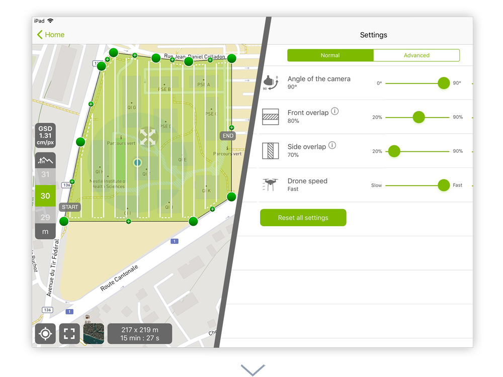

@title[unmanned aerial systems field operations and mission planning]
#### unmanned aerial systems (uas)
##### field operations and mission planning
###### D.J. Biddle, GISP
---
@title[the plan] 
#### the plan
- The Big Picture: Guiding Principles
- Study Area Reconnaissance: Know B4 U Go!
- Mission Plan Design: Match the application
- The Day Of: Checking the boxes 
- Aeronautical Decision Making: Cool heads prevail
- If It All Goes South: Accident Procedures
---
@title[the big picture]
#### The Big Picture!
What is our objective?...  
  
@css[fragment](Capture **high quality imagery**) @css[fragment](of our **study area**,) @css[fragment](to suit the intended **application**,) @css[fragment](in a **safe, efficient, and professional** manner.)  
  
@css[fragment](All decisions related to field operations should emanate from this simple objective!)
+++
@title[Study Area Reconnaissance]
#### Study Area Reconnaissance
##### Know B4 U Go! 
Our first task is to become familiar with the study area and its vicinity...  

  @css[fragment](general reconnaisance can be guided by a few questions.)
+++
@title[Study Area Reconnaissance]
#### Study Area Reconnaissance   
@ul[squares]
- Where is the site? @css[fragment](**lat/long/elev/area of interest?**)
- How will we access it? @css[fragment](**driving/walking/need permissions?**)
- What is the terrain? @css[fragment](**steep slopes/tall trees/obstructions?**)
- Airspace considerations? @css[fragment](**require ATC permission/nearby facilities?**)
- What type of data to collect? @css[fragment](**aerial photos/3D Models/IR imagery?**) 
@ulend
+++
@title[Study Area Reconnaissance]
#### Study Area Reconnaissance
Our main tools will be exisitng maps and imagery of the area.  
  
- [Google Maps/Streetview](https://maps.google.com)
- [Google Earth](https://earth.google.com)
- [Skyvector](https://www.skyvector.com)
- [Know B4 U Fly](http://knowbeforeyoufly.org/air-space-map/)
- [USGS Topo Maps](https://www.arcgis.com/home/item.html?id=99cd5fbd98934028802b4f797c4b1732)
+++
@title[Study Area Reconnaissance]
#### An example
<iframe width="800" height="600" data-src="https://centerforgis.maps.arcgis.com/apps/Embed/index.html?webmap=191fad03a33d4b73a2910a1a71af81aa&extent=-83.357,38.1425,-83.3427,38.1476&zoom=true&previewImage=false&scale=true&search=true&searchextent=true&details=true&basemap_gallery=true&disable_scroll=true&theme=dark"></iframe>
---
@title[Mission Plan Design]
#### Misson Plan Design
The *image acquisiton plan* that we design to capture imagery, will vary based on several factors...  
  
@ul[squares]
- Drone and camera type
- Image product priorities (2D Maps vs 3D Maps/Point Clouds, Area vs Structure)
- Area to be flown (shape and size)
- Terrain considerations
@ulend
+++
##### A quick word on image processing...
The magic of UAS imagery lies in Structure from Motion (SfM) image processing...
- 3D reconstruction based on point matching between overlapping images
- Same principle as stereoscopic imagery
 - **parallax**: displacement of an object caused by a change in the point of observation
+++
##### Image Parallax

+++
##### SfM processing from overlapping images

+++
#### Misson Plan Design
We will use [Pix 4D Capture](https://www.pix4d.com/product/pix4dcapture) for planning and executing flight plans, but there are many options available, including...  
  

- [DroneDeploy](https://www.dronedeploy.com/product/mobile/)
- [DJI Ground Station Pro](https://www.dji.com/ground-station-pro)
- [UGCS](https://www.ugcs.com/)
- [Precision Flight Pro](https://www.precisionhawk.com/precisionflight)

+++
#### Misson Plan Design
##### Drone and Camera Type
@size[0.6em](The sensor used will define ground sampling distance/GSD of resultant imagery. The sensor's area, resolution, and lens focal length, all contribute to the calculated GSD at a given altitude.)

<iframe class="stretch" data-src="https://www.propelleraero.com/gsd-calculator/"></iframe>
+++
#### Misson Plan Design
##### Drone and Camera Type
In our mission planning software...  
  

+++
#### Misson Plan Design
##### Image Types
Different image priorities necessitate different flight parameters...  
  
@css[fragment](Simple 2D aerial photos/surface models demand a **nadir** camera angle with **75% frontal overlap**, and **60% side overlap**, in a simple grid pattern)  
+++  

+++
#### Misson Plan Design
##### Image Types
Whereas study areas with lots of vertical structure and complex geometry may require **oblique** camera angles, and a **double grid** flight pattern to obtain enough information for 3D reconstruction.  
+++  

+++
#### Nadir vs. Oblique 

+++
#### Mission Plan Design
Our flight planning software provides for a number of mission types to suit the application. 

+++
#### Single Grid Flights
Appropriate For...
@ul[squares]
- 2D Map Outputs (DSM, orthophoto)
- Low relief (flat) areas 
- Large study areas 
@ulend
+++
#### Single Grid Flights

+++
#### Double Grid Flights
@ul[squares]
- 3D Map Outputs (point cloud, 3D mesh)
- Sites with complex vertical structure (buildings, forest)
- Smaller areas (double grid = 2x flight time)
@ulend
+++
#### Double Grid Flights

+++
#### Polygon Grid Flights
@ul[squares]
- Irregularly shaped study areas
- Flight area constraints (e.g. terrain or airpace)
- Single grid pattern guidance applies
@ulend
+++
#### Polygon Grid Flights

+++
#### Circular Flights
@ul[squares]
- Elliptical orbit around central target
- Oblique imagery
- 3D Model Outputs (point cloud, 3D mesh)
- Modelling an isolated feature (e.g. statue, antenna, building)
- Limited area
@ulend
+++
#### Circular Flights

+++
#### Free Flight
@ul[squares]
- for complex environments
- UAS flown by hand
- Camera triggered by intervalometer
- Image captured every *x* seconds or *y* change in position
+++
#### Free Flight

+++
#### Defining The Area of Interest
@size[0.6em](Optimize the flight pattern by interactively adjusting the flight area polygon)  
+++ 

+++
@transition[fade-in fade-out]	  

+++
@transition[fade-in fade-out]	  

+++
#### Mission Settings 
@size[0.6em](For most mission types, a number of different settings can be used to tweak the flight plan to suit demands.)  
  

+++
  

+++
@transition[fade-in fade-out] 

@css[fragment](Flight height controls GSD)  
+++
@transition[fade-in fade-out] 

  
+++
@transition[fade-in fade-out] 

@css[fragment](Increase overlap for 3D applications) 
+++
@transition[fade-in fade-out] 

@css[fragment](Or reduce for shorter flight times)  
+++
@transition[fade-in fade-out] 

@css[fragment](Vary the flight speed for light conditions. Slower speeds in lower light reduce blurry images.)
+++
#### High Relief Areas
SfM processing algorithms expect GSD to be consistent across a project.  
  
@css[fragment](In high relief/rugged topography, the difference in GSD from the high point to the low can exceed the software's tolerance.)  
  
@css[fragment](Mission plans should account for this in one of three ways)
+++
**Fly higher**  
If the flight height at the high end is more than twice that at the low end, flying from a higher altitude can reduce this ratio. 

@css[fragment](Example: Flight at 100ft AGL at the higher end, 200ft AGL at the lower end...2x ratio)  
  
@css[fragment](Fly 100ft higher: Flight at high end now 200ft AGL, 300ft AGL at low end...1.5x ratio) 
+++

+++
**Terrain Following**  
Use a software that accounts for terrain variation by using digital elevation (DEM) data. Flight altitude changes according to terrain.  
  

+++
**Stairstepped Flights**  
Fly multiple missions at staggered altitudes to ensure a consistent GSD.  
  

---
#### The Day Of...
After you have researched your study area, designed your mission plans, received your ATC authorizations, etc...there's nothing left but to...  
  
@css[fragment](Do the dang thing!) 
+++
#### The Day Of...
When the time comes to travel to the study area and acquire imagery, what should be our prime considerations?  
  
@ol[numbers]
- SAFETY!
- SAFETY!
- Weather...particularly winds
- Crew management
- Equipment management
- Process management
@olend
+++
#### The Day Of...
##### Safety
Pilots of all craft are addicted to **checklists!** Checklists are effective ways to make sure your operations are consistent, successful, and SAFE. There is a checklist for nearly everything in flying. Let's take a look at a field operations safety checklist...  
+++
[**UAS Safety Checklist**](https://air-vid.com/uav-safety-checklist)  
<iframe class="stretch" data-src="https://air-vid.com/uav-safety-checklist/"></iframe> 
+++
#### The Day Of...
##### Weather
Mother nature has a way of disrupting even the best laid plans...CHECK THE WEATHER!  
  
@css[fragment](Use the NOAA/FAA resources like METARs, TAFs, AWOS, etc)  
  
@css[fragment](But also use good common sense!)
+++
#### The Day Of...
##### Weather
What are some common weather related challenges?  
  
@css[fragment](Most commercially available UAS systems are not approved for flight in precipitation. Rain delay!)  
  
@css[fragment](Preference for overcast/diffuse light to reduce harsh shadows in our imagery...fly close to local noon!)  
  
@css[fragment](The biggest factor by far is...)@css[fragment](WIND!)
+++
#### The Day Of...
##### Weather
**High wind speeds** have numerous negative impacts on UAV flight...  
  
@ul
- Shorter battery life/reduced flight times
- Groundspeed variability during missions
- Challenging take offs/landings...especially in tight quarters. 
- Increased risk of loss of equipment
+++
#### The Day Of...
##### Weather
Many drones can fly in wind speeds ~20mph...  
  
@css[fragment](but the wind speeds at the surface are NOT the same as the winds aloft)  
  
@css[fragment](gusts can exceed the UAS's capacity to react)  
  
@css[fragment](and eddy currents around structures can create turbulent air)
+++

+++
#### The Day Of...
##### Weather
**Know your winds before you go**
https://www.uavforecast.com 

<iframe class="stretch" data-src="https://www.uavforecast.com"></iframe>
---

#### Finished

 

 

